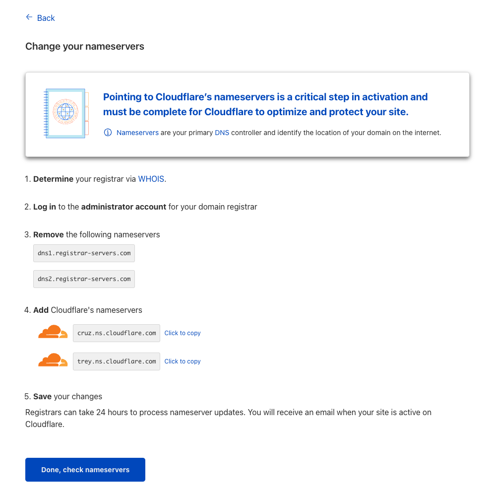
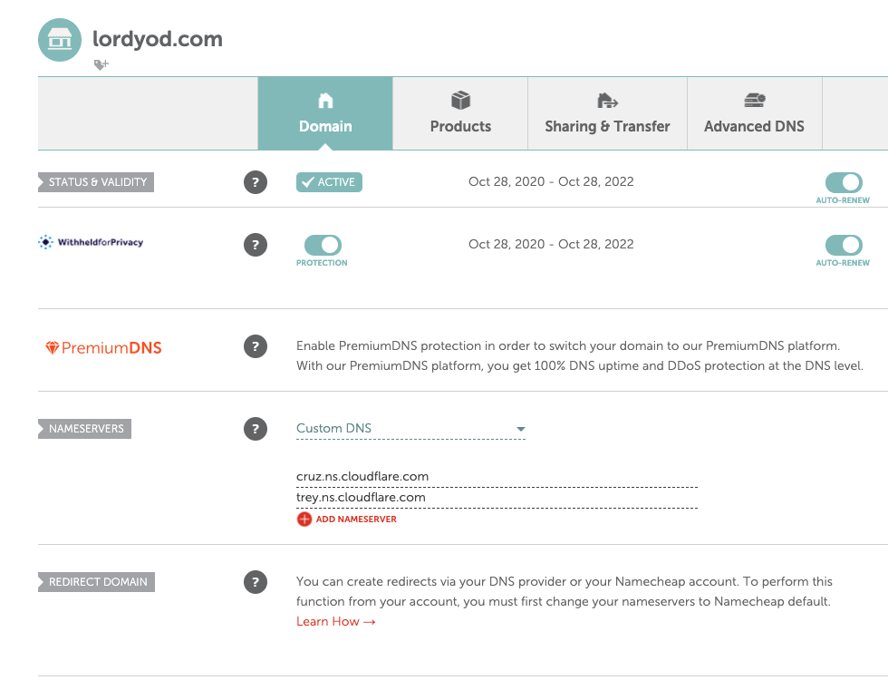
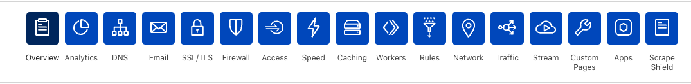
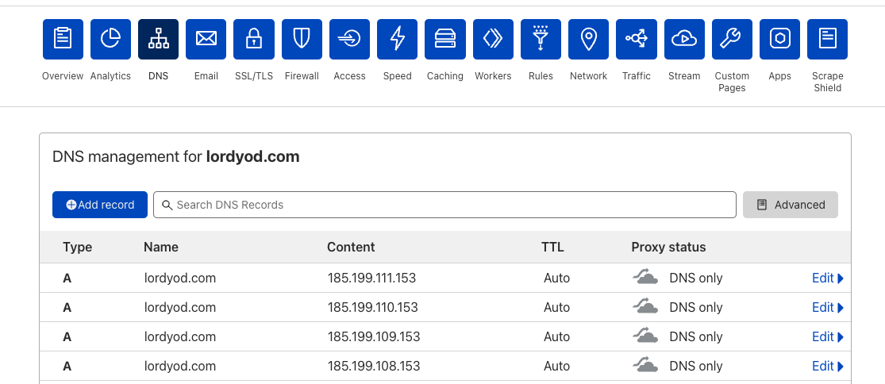
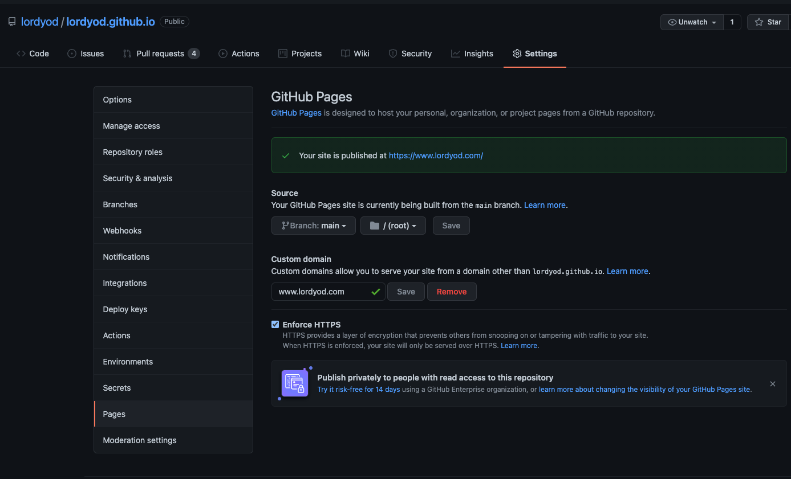
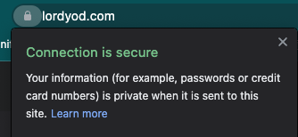

# Enabling HTTPS with Github Pages and Cloudflare


In my post on [Hosting with Hugo]() we
build a blog using the Hugo static site generator and deployed it to Github
Pages. In this post, we'll walk through the steps to enable HTTPS on our blog.
When we're done, we'll have a blog secured with HTTPS and reachable at a custom
domain name instead of `username.github.io`.
<!--more-->

Long story short, every website should have HTTPS enabled automatically. Instead
of going into any kind of detail here I'll just refer to Cloudflare's excellent
[Why use HTTPS?](https://www.cloudflare.com/learning/ssl/why-use-https/) page
for more information. The good news is that Github Pages have HTTPS enforced by
default. The bad news is that you need to jump through some extra hoops to
enable this on a custom domain. Let's walk through each of these steps now.

## Buy a domain name

There's no getting around this one. There are lots of hosting providers out
there, personally I like [Namecheap](https://www.namecheap.com). If you look
around I'm sure you'll find testimonials one way or another, and I imagine
coupons and such too. My domains are pretty cheap, clocking in at about
$13/year. Some providers have extra features, such as some kind of [domain
privacy
protection](https://www.namecheap.com/security/what-is-domain-privacy-definition/).

## Configure DNS forwarding with Cloudflare

If you don't already have one, head over to
[Cloudflare](https://www.cloudflare.com) and create an account. Once that's
done, head to the main dashboard and add a new site. Enter the domain name you
just bought. The free plan is what you want if you're reading this page. Once
Next the Cloudflare system will automatically generate some DNS records based on
what was built by default at your provider. You can accept the defaults for now.

## Update nameservers at provider

The next step will be to configure our domain name provider to point to
Cloudflare for name resolution. Cloudflare should give you a page that looks
like this:



If we head over to our domain name provider we can modify our domain settings to
set custom DNS servers. Here is what this looks like using Namecheap:



As you can see I've configured my custom DNS settings with the server info given
by Cloudflare. The next step is to head back to Cloudflare and click the _Done,
check nameservers_ button. Cloudflare will check that this is set right and then
proceed with offering to improve security or performance by enabling some
options. You should probably turn these on but it's not pertinent to this post.
Click through until you are taken to the dashboard.



Once you see this control panel, click _DNS_ and we'll set up entries to point
to Github.



Here we see the configuration for my site, with the `A` records added already.
These records make it so requests for my site are forwarded to one of these IPs
automatically (the specific one is selected based on load). You'll want to add
these records manually:

| Type | Name | Address |
|------|------|---------|
|  `A` | `@`  | `192.199.108.153` |
|  `A` | `@`  | `192.199.109.153` |
|  `A` | `@`  | `192.199.110.153` |
|  `A` | `@`  | `192.199.111.153` |
|  `CNAME` | `www`  | `{sitename}.github.io` |

On each of these you want to set _DNS Only_ instead of proxying. The four `A`
entries are address records which will return the Github Pages IP address when
your website URL is requested. The `CNAME` record is a _canonical name record_
which aliases one name to another. This responds to requests for
`www.yoursite.com` by telling the client to search for `{sitename}.github.io`
instead. (Make sure `{sitename}` is configured correctly to the public blog repo
we set up last time.) That's it for our Cloudflare settings, we can head back to
Github to finish up.

## Configure Github settings

Head back to your public repo and open up _Settings > Pages_. Enter in your
custom domain name in the _Custom domain_ field and click save:



Github will take a minute or two to make a DNS query to check that all your
settings are correct. (This _can_ take a while, but in my experience if you're
setup right it should be less than 10 minutes) Once Github has verified this,
you will be able to click the _Enforce HTTPS_ box, which causes Github to
automatically configure certificates using Let's Encrypt. That's it for the
public repo settings. The last step is to make our changes permanent in our
private repo.

## Push CNAME in private repo

This step is pretty simple, all you need to do is make sure that the `public`
directory gets created with your `CNAME` file in it:

```bash
blog on  main [!?]
✦ ➜ mkdir -p public

blog on  main
✦ ➜ echo "www.mysite.com" >> public/CNAME
```

Commit this change and push it to your repo, and once the site has deployed you
should see the certificate is all setup and your connection to the blog is
secure:



## Final words

Now that we've got HTTPS set up on our site, it's possible for us to enable all
sorts of integrations. Next up we'll see how we can add a comment system so we
can interact with our audience.

