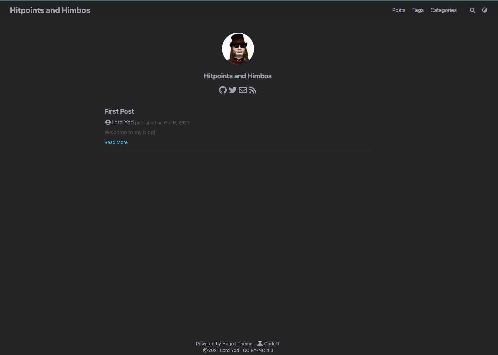
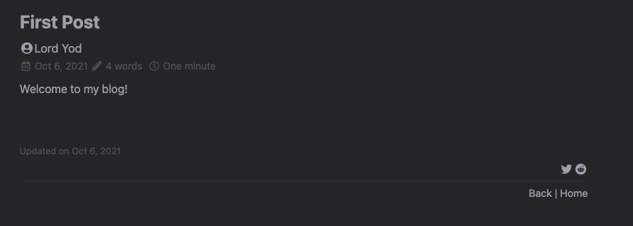
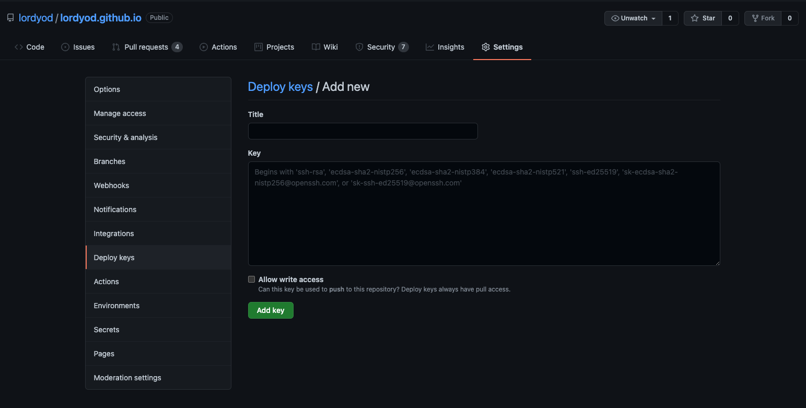
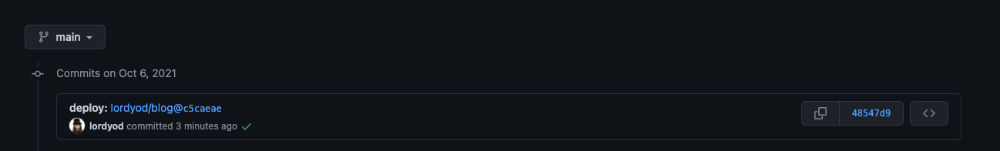
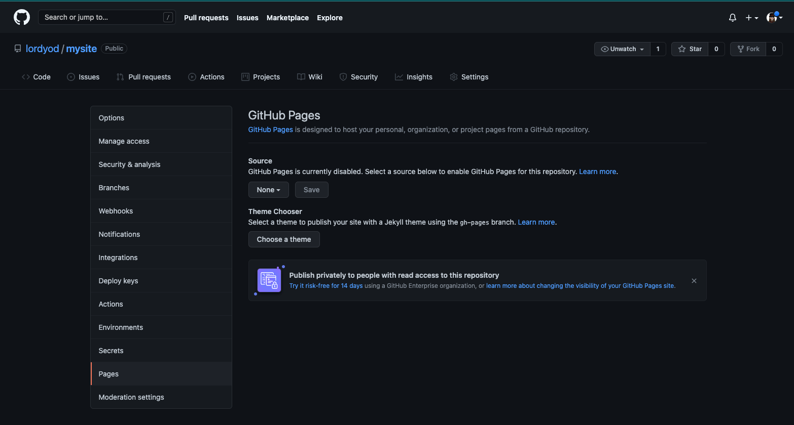

# Hosting With Hugo


This blog is built using [Hugo](https://gohugo.io/), a framework for building
static websites. In this post I'll walk through how I've set up a private
[Github](https://www.github.com) repo with continous deployment to a public
site hosted with [Github Pages](https://guides.github.com/features/pages/)
to host my blog.
<!--more-->

Hugo sites are written using Markdown, which is used to generate the static
site itself.  I've configured this site using a private repository on
[Github](https://www.github.com) with an automated deployment process using
[Github Actions](https://github.com/features/actions).

## Install Hugo

The first step is installing Hugo to your local system. On my Mac I use
[Homebrew](https://brew.sh) as my primary package manager so this is quite simple:

```bash
~/git
➜ brew install hugo
==> Downloading https://ghcr.io/v2/homebrew/core/hugo/manifests/0.88.1
Already downloaded: /Users/petewilcox/Library/Caches/Homebrew/downloads/3a32d8dc27413a9318978287a25a2862c05e05a105e6e15a2d8ce73b8dc7d369--hugo-0.88.1.bottle_manifest.json
==> Downloading https://ghcr.io/v2/homebrew/core/hugo/blobs/sha256:b815e48af3443fc123ce4d874cf038c25b798ea1944c960618ba3f036020e631
Already downloaded: /Users/petewilcox/Library/Caches/Homebrew/downloads/91c2118189d19ec52f41509e3ac9587affe6b3836f7717e07de6bf639bbf6f29--hugo--0.88.1.arm64_big_sur.bottle.tar.gz
==> Pouring hugo--0.88.1.arm64_big_sur.bottle.tar.gz
🍺  /opt/homebrew/Cellar/hugo/0.88.1: 49 files, 53MB
```

Once Hugo is installed we start a new project and configure it as a git repo

```bash
~/git took 4s
➜ hugo new site mysite
Congratulations! Your new Hugo site is created in /Users/lordyod/git/mysite.

Just a few more steps and you're ready to go:

1. Download a theme into the same-named folder.
   Choose a theme from https://themes.gohugo.io/ or
   create your own with the "hugo new theme <THEMENAME>" command.
2. Perhaps you want to add some content. You can add single files
   with "hugo new <SECTIONNAME>/<FILENAME>.<FORMAT>".
3. Start the built-in live server via "hugo server".

Visit https://gohugo.io/ for quickstart guide and full documentation.

~/git
➜ cd mysite

~/git/mysite
➜ git init
Initialized empty Git repository in /Users/lordyod/git/mysite/.git/

mysite on  main [?]
➜
```

Hugo scaffolds new projects with the needed directories so we just need to worry
about what to put where:

```bash
mysite on  main [?]
➜ tree
.
├── archetypes
│   └── default.md
├── config.toml
├── content
├── data
├── layouts
├── static
└── themes

6 directories, 2 files
```

## Install a theme

There are a couple of ways to install themes but I like having them as
submodules as it keeps things nice and tidy.  For this blog I'm using
[CodeIT](https://github.com/sunt-programator/CodeIT) but Hugo has a ton of
themes available [here](https://themes.gohugo.io/):

```bash
mysite on  main [?]
➜ git submodule add https://github.com/sunt-programator/CodeIT.git themes/CodeIT
Cloning into '/Users/lordyod/git/mysite/themes/CodeIT'...
remote: Enumerating objects: 11814, done.
remote: Counting objects: 100% (626/626), done.
remote: Compressing objects: 100% (400/400), done.
remote: Total 11814 (delta 364), reused 400 (delta 216), pack-reused 11188
Receiving objects: 100% (11814/11814), 40.80 MiB | 23.12 MiB/s, done.
Resolving deltas: 100% (6041/6041), done.
```

Now we have our theme installed as a submodule of our blog source repo, so if we
ever need to update we can do so cleanly. Hugo makes it easy to do things like
customize individual elements of the theme via templates.

## Edit config.toml

Next up we edit the `config.toml` to set up our site:

```toml
baseURL = 'https://www.lordyod.com/'
languageCode = 'en-us'
defaultContentLanguage = 'en'
title = 'Hitpoints and Himbos'

theme = 'CodeIT'

[params]
  version ='0.2.X'
  description = 'Thoughts on gaming and tech'
  keywords = ['RPG', 'D&D', 'OSR']
  defaultTheme = 'auto'
  fingerprint = "sha512"
  dateFormat = 'Jan 2, 2006'
  images = ['/logo.png']

  [params.app]
    title = 'Hitpoints and Himbos'
    noFavicon = false
    svgFaveicon ='static/favicon.ico'
    themeColor = '#ffffff'
    iconColor = '%5bbad5'
    titleColor = '%da532c'

  [params.search]
    enable = true
    type = 'lunr'
    contentLength = 4000
    placeholder = ''
    maxResultLength = 10
    snippetLength = 30
    highlightTag = 'em'
    absoluteURL = 'false'
    [params.search.algolia]
      index = ''
      appID = ''
      searchKey = ''

  [params.header]
    destopMode = 'fixed'
    mobileMode = 'auto'
    [params.header.title]
      logo = ''
      name = 'Hitpoints and Himbos'
      pre = ''
      post = ''
      typeit = false

    [params.footer]
      enable = true
      custom = ''
      hugo = true
      copyright = true
      author = true
      since = 2021
      icp = ''
      license = '<a rel="license external nofollow noopener noreffer" href="https://creativecommons.org/licenses/by-nc/4.0/" target="_blank">CC BY-NC 4.0</a>'

    [params.section]
      paginate = 20
      dateFormat = '01-02'
      rss = 10

    [params.list]
      paginate = 20
      dateFormat = '01-02'
      rss = 10

    [params.home]
      rss = 10
      [params.home.profile]
        enable = true
        gravatarEmail = 'gravatar@lordyod.com'
        avatarURL = '/images/avatar.png'
        title = 'Hitpoints and Himbos'
        subtitle = ''
        typeit = true
        social = true
        disclaimer = ''
      [params.home.posts]
        enable = true
        paginate = 6
        defaultHiddenFromHomePage = false

    [params.social]
      GitHub = 'lordyod'
      Twitter = 'lordyod'
      Youtubechannel = ''
      Email = 'blog@lordyod.com'
      RSS = true

    [params.page]
      hiddenFromHomePage = false
      hiddenFromSearch = false
      twemoji = false
      lightgallery = false
      ruby = false
      fraction = false
      fontawesome = false
      linkToMarkdown = false
      rssFullText = false
      [params.page.toc]
        enable = false
        #keepStatic = true
        #auto = true
      [params.page.math]
        enable = false
        #copyTex = true
      [params.page.code]
        copy = true
        maxShownLines = 10
      [params.page.share]
        enable = true
        Twitter = true
        Reddit = true
        Blogger = false

  [menu]
    [[menu.main]]
      identifier = "posts"
      pre = ""
      post = ""
      name = "Posts"
      url = "/posts"
      title = ""
      weight = 1
    [[menu.main]]
      identifyer = "tags"
      pre = ""
      post = ""
      name = "Tags"
      url = "/tags/"
      weight = 2
    [[menu.main]]
      identifier = "categories"
      pre = ""
      post = ""
      name = "Categories"
      url = "/categories/"
      title = ""
      weight = 3

[markup]
  [markup.highlight]
    codeFences = true
    guessSyntax = true
    lineNos = true
    lineNumbersIntTable = true
    noClasses = false

[author]
  name = "Lord Yod"
  email = "blog@lordyod.com"
  link = "https://www.lordyod.com"

[sitemap]
  changefreq = 'weekly'
  filename = 'sitemap.xml'
  priority = 0.5

[Permalinks]
  posts = ":filename"

[mediaTypes]
  [mediaTypes."text/plain"]
    suffixes = ["md"]

[outputFormats.MarkDown]
  mediaType = "text/plain"
  isPlainText = true
  isHTML = false

[outputs]
  home = ["HTML", "RSS", "JSON"]
  page = ["HTML", "MarkDown"]
  section = ["HTML", "RSS"]
  taxonomy = ["HTML", "RSS"]
  taxonomyTerm = ["HTML"]
```

The settings used here are going to depend on the theme you choose and if you
want to do anything extra concerning customizing Hugo's systems. The defaults
work for me in most cases.

## Write the first blog post

There are a couple ways to make posts depending on how you want to store
content. The simplest is to make individual Markdown files, which are stored in
`/content/`:

```bash
mysite on  main [+?]
➜ hugo new posts/first-post.md
/Users/lordyod/git/mysite/content/posts/first-post.md created
```

Hugo automatically generates the [front matter](https://gohugo.io/content-management/front-matter/)
for the post and places the file in the right location. We just need to open it
with our favorite editor. I use [Neovim](https://neovim.io/):

```md
---
title: "First Post"
date: 2021-10-06T17:04:45-07:00
draft: true
---

Welcome to my blog!
```

What we see here are two basic elements. The second element is the actual text
of the post, which is written in Markdown and should be relatively
straightforward. The more interesting part is the first element, the
_front matter_, which Hugo generates in `.yaml` format by default:

```yaml
---
title: "First Post"
date: 2021-10-06T17:04:45-07:00
draft: true
---
```

We see that Hugo has filled in the title and date for us and then set `draft:
true`. Additional front matter elements we might want to use include:

* `description`: a description of the post.
* `keywords`: a list of keywords in the post.
* `tags`: a list of tags for the post. Hugo automatically generates meta pages
    for tags and categories, which we'll see later.
* `slug`: allows you to override the URL, if this is not set then the filename
    is used.
* `categories`: like tags, allows you to have Hugo organize the post in a
    generated meta list.

There are a lot of capabilities I have skipped over here, read the docs for the
full list.

## Host the server locally

Okay that's great, now how do we see what the post will look like? Hugo has a
great live rendering capability:

```bash
mysite on  main [+?] took 2s
➜ hugo server -D
Start building sites …
hugo v0.88.1+extended darwin/arm64 BuildDate=unknown
WARN 2021/10/06 17:14:29

Current environment is "development". The "comment system", "CDN" and "fingerprint" will be disabled.
当前运行环境是 "development". "评论系统", "CDN" 和 "fingerprint" 不会启用.

                   | EN
-------------------+-----
  Pages            | 10
  Paginator pages  |  0
  Non-page files   |  0
  Static files     | 83
  Processed images |  0
  Aliases          |  2
  Sitemaps         |  1
  Cleaned          |  0

Built in 44 ms
Watching for changes in /Users/petewilcox/git/mysite/{archetypes,content,data,layouts,static,themes}
Watching for config changes in /Users/petewilcox/git/mysite/config.toml
Environment: "develpment"
Serving pages from memory
Running in Fast Render Mode. For full rebuilds on change: hugo server --disableFastRender
Web Server is available at http://localhost:1313/ (bind address 127.0.0.1)
Press Ctrl+C to stop
```

The command `hugo server` tells Hugo to run a local server out of the current
directory structure, and the flag `-D` tells it to render draft content. Now if
we open a web browser and go to `http://localhost:1313` we see the main page of
our blog showing our post:



If we click the post title it takes us to the post itself:



By default the `hugo server` command runs with live reload, meaning any changes
to the site are reflected immediately in your local version. This is great for
figuring out formatting issues and the like.

## Push code to Github

Now it's time to commit our changes and push to Github. Create a new private
repository on Github and get the remote URL, which will be something like:

```sh
git@github.com:lordyod/mysite.git
```

Locally we'll add it as a remote and push our code to it:

```sh
mysite on  main [+?] took 2s
➜ git remote add origin git@github.com:lordyod/mysite.git

mysite on  main [+?]
➜ git add .

mysite on  main [+]
➜ git commit -m "first commit"
[main (root-commit) 9d8753a] first commit
 7 files changed, 199 insertions(+)
 create mode 100644 .gitmodules
 create mode 100644 archetypes/default.md
 create mode 100644 config.toml
 create mode 100644 content/posts/first-post.md
 create mode 100644 resources/_gen/assets/scss/css/style.scss_d75fd08668b4bae707167bbce4d8ca46.content
 create mode 100644 resources/_gen/assets/scss/css/style.scss_d75fd08668b4bae707167bbce4d8ca46.json
 create mode 160000 themes/CodeIT

mysite on  main took 14s
➜ git push --set-upstream origin main
Enumerating objects: 17, done.
Counting objects: 100% (17/17), done.
Delta compression using up to 8 threads
Compressing objects: 100% (9/9), done.
Writing objects: 100% (17/17), 12.20 KiB | 2.44 MiB/s, done.
Total 17 (delta 0), reused 0 (delta 0), pack-reused 0
To github.com:lordyod/mysite.git
 * [new branch]      main -> main
Branch 'main' set up to track remote branch 'main' from 'origin'.
```

## Configure public repository and setup deploy key

Now that we have our code in our private repo, we will set up a repo to host the
public blog. Create another repo named `<username>.github.io` (replace
`<username>` with your user) and make sure it is set as public. Once it's set
up, create a new SSH key on your local machine with the command:

```sh
mysite on  main
➜ ssh-keygen -t rsa -b 4096 -C "$(git config user.email)" -f gh-pages -N ""
Generating public/private rsa key pair.
Your identification has been saved in gh-pages
Your public key has been saved in gh-pages.pub
The key fingerprint is:
SHA256:qaLYfAduznFzLt5ibXINL/fCv/KZlP79PK20K+oh4Qs github@lordyod.com
The key's randomart image is:
+---[RSA 4096]----+
|                 |
|                 |
|                 |
|         .       |
|        S        |
|    .  o..   .   |
|   .o.E.+=. o . .|
| + o++**=oB+.+ =.|
|. ++o+.*++oBO+=o*|
+----[SHA256]-----+
```

We're going to use this key pair to setup our CI/CD using Github Actions. In
order to do that we'll copy the _public_ key `gh-pages.pub` and configure it as
a deploy key by going to our public repo `<username>.github.io`, then navigating
to _Settings > Deploy keys > Add deploy key_. Paste the key into the box and
save.



Next we'll take the _private_ key and store it as a secret in our private
repo by navigating to the `mysite` repo, then _Settings > Secrets > New
repository secret_. Name this secret `ACTIONS_DEPLOY_KEY` and paste the
_private_ key `gh-pages` into the text box and click _add secret_.

## Configure Github action workflow

Now that we have our deploy key configured, we are ready to add an action to
make use of it. Github actions allow us to configure workflows which execute in
response to certain events, which we will use in this instance to have a bot
automatically build our site with Hugo and then push the static content to our
public repo. This way, we can keep the actual content we use to generate the
site in a private repo where others won't be able to interact with it.

We're going to use the [GitHub Actions for Hugo](https://github.com/peaceiris/actions-hugo)
and
[GitHub Actions for GitHub Pages](https://github.com/peaceiris/actions-gh-pages)
actions to accomplish this, both by [Shohei Ueda](https://github.com/peaceiris/actions-hugo).
To configure Github actions we add workflow definition `.yml` file to
`.github/workflows/` in the root of our private repository.

```yaml
name: CI
on: push
jobs:
  deploy:
    runs-on: ubuntu-20.04
    steps:
      - name: Git checkout
        uses: actions/checkout@v2

      - name: Update theme
        # (Optional)If you have the theme added as submodule, you can pull it
        # and use the most updated version
        run: git submodule update --init --recursive

      - name: Setup hugo
        uses: peaceiris/actions-hugo@v2
        with:
          hugo-version: "0.88.0"

      - name: Build
        # remove --minify tag if you do not need it
        # docs: https://gohugo.io/hugo-pipes/minification/
        run: hugo --minify

      - name: Deploy
        uses: peaceiris/actions-gh-pages@v3
        with:
          # Use configured private key to deploy to public repo
          deploy_key: ${{ secrets.ACTIONS_DEPLOY_KEY }}

          # Public repo information
          external_repository: lordyod/lordyod.github.io

          # Local path to site source, pushed to root of external repo
          publish_dir: ./public

          # Whether we should overwrite extra files in the repo
          keep_files: true

          # user credentials
          user_name: "lordyod"
          user_email: "github@lordyod.com"

          # Branch to publish on
          publish_branch: main

          # used for DNS settings to enable HTTPS
          cname: www.lordyod.com
```

This workflow runs five steps:

1. Checkout the private repo
2. Update the theme
3. Install Hugo
4. Build the site, using the `--minify` flag to reduce its size
5. Deploy the site to the public repo

The `deploy_key` field is automatically populated with the secret we stored in
our private repo earlier. Now we'll commit this code and push it to Github,
where we can open the _Actions_ tab to view its progress:


Once the action is complete we can verify it deployed by going to the public
repo and looking at the commit log:



## Publish site

Now our site has been uploaded to our public repo, we are ready to publish it
using Github Pages. Head to the public repo page, then navigate to _Settings >
Pages_. Select the _Source_ dropdown and pick the `main` branch, then pick the
`/ (root)` location and click save.



And just like that, our site will go live at
`<username>.github.io`!

## Final words

Going forward, all you need to do in order to publish new posts is use `hugo new
posts/mypost.md` to create the template, edit the markdown in your editor, then
commit and push to your private repo. Our configured Github Action will take
care of building and deploying the generated static site to our public repo.
There are some further steps we can take to enhance our new blog with comments,
social sharing, and a custom domain name using HTTPS, which I'll go into next
time.

